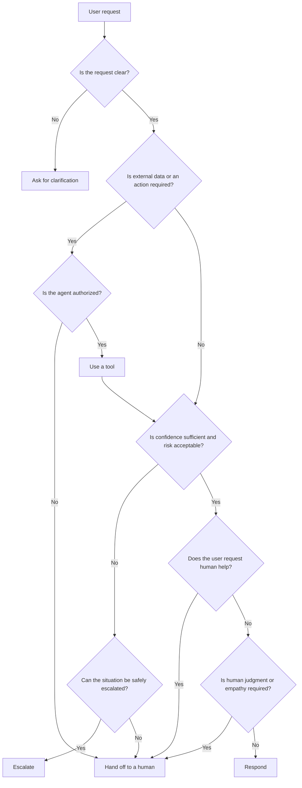

# AI Agent Handoff Patterns

Practical patterns for deciding when AI agents should respond, ask, use tools, escalate or hand off to humans.

## Why this project exists

AI agents should not try to handle every situation autonomously.

In real-world products, a good agent needs to recognize when it has enough context to act, when it needs more information, when a tool should be used and when a human should take over.

This repository explores reusable interaction and decision patterns for building safer, clearer and more human-centered AI experiences.

## Core decisions

An AI agent should be able to decide whether to:

1. **Respond**
   Answer directly when the request is clear and within its capabilities.

2. **Ask**
   Request additional context when important information is missing.

3. **Use a tool**
   Retrieve data or perform an action through an external system.

4. **Escalate**
   Route the situation to a specialized flow or higher-confidence process.

5. **Hand off to a human**
   Transfer control when human judgment, authorization or empathy is required.

## Handoff principles

Good handoff decisions should consider more than technical capability.

The agent should evaluate:

### Confidence
How certain is the agent that it understands the request and can respond correctly?

Low confidence should increase the likelihood of asking for clarification or escalating.

### Risk
What is the potential impact of a wrong answer or action?

Higher-risk situations should require stronger safeguards, additional validation or human review.

### User intent
Does the user explicitly want human assistance, or is the request better suited to human judgment?

A clear request for a person should be respected whenever possible.

### Authorization
Is the agent allowed to perform the requested action?

Some actions may require approval, identity verification or permissions that the agent does not have.

### Context completeness
Does the agent have enough information to make a reliable decision?

Missing critical information should trigger clarification instead of guessing.

### Emotional sensitivity
Does the situation involve frustration, conflict, vulnerability or a need for empathy?

Some interactions are better handled by a human even when the agent technically knows the answer.

### Recoverability
Can a wrong decision be easily reversed?

Irreversible or costly actions should have a lower threshold for escalation or human confirmation.

## Decision matrix

The following matrix provides a simple starting point for choosing the next action.

| Situation | Recommended action |
|---|---|
| Clear request, sufficient context, low risk | **Respond** |
| Important context is missing | **Ask** |
| External information or an action is required | **Use a tool** |
| Low confidence or higher-risk situation | **Escalate** |
| User explicitly requests a person | **Hand off to a human** |
| Authorization is required and unavailable | **Hand off to a human** |
| Emotionally sensitive or conflict-heavy interaction | **Hand off to a human** |
| Irreversible or high-impact action | **Escalate or require human confirmation** |

### Important

These patterns are not intended to replace domain-specific rules.

The appropriate thresholds for confidence, risk and authorization depend on the product, organization and regulatory context in which the agent operates.

## Decision flow

A simple decision path can help make the handoff logic explicit.

## Pattern 01: Explicit Human Request

### Scenario

The user explicitly asks to speak with a human, agent, specialist or representative.

Examples:

- "I want to talk to a person."
- "Can you transfer me to an agent?"
- "I need human support."
- "Please let me speak with someone."

### Rule

When the user clearly requests human assistance, the agent should not force additional automation unless a required safety or routing step must happen first.

### Expected behavior

The agent should:

1. Acknowledge the request.
2. Avoid unnecessary persuasion to continue with the AI.
3. Collect only the minimum information required for routing.
4. Preserve relevant conversation context.
5. Transfer the conversation to the appropriate human queue or agent.
6. Clearly tell the user what will happen next.

### Example

**User**

> I want to speak with a human.

**Agent**

> Of course. I'll transfer your conversation to a human agent and keep the context from our conversation so you don't need to repeat everything.

### Anti-pattern

Avoid responses such as:

> Before transferring you, let me try one more time to solve your problem.

If the user has clearly requested human assistance, unnecessary friction can reduce trust and worsen the experience.

### Implementation note

The exact handoff mechanism depends on the platform.

In an omnichannel environment, a handoff may involve:

- assigning the conversation to a human team;
- changing an inbox, queue or routing state;
- attaching conversation context;
- disabling automated replies temporarily;
- notifying the user that a human will continue the interaction.

## Pattern 02: Missing Critical Context

### Scenario

The user asks for something that cannot be handled reliably because important information is missing.

Examples:

- "Can you check my application?"
- "Change the address on my account."
- "Why was this request rejected?"
- "Can you send the document again?"

In these cases, the request may be understandable, but the agent may still lack the information required to act safely or accurately.

### Rule

When critical context is missing, the agent should ask for the minimum additional information required to continue.

The agent should not invent missing details, make unsupported assumptions or move directly to escalation if clarification can safely resolve the uncertainty.

### Expected behavior

The agent should:

1. Identify which information is actually missing.
2. Ask only for information that is necessary to continue.
3. Explain why the information is needed when appropriate.
4. Avoid asking for information already available in the conversation or system context.
5. Re-evaluate the request after receiving the missing context.
6. Escalate only when the missing information cannot be obtained or safely resolved.

### Example

**User**

> Can you check the status of my request?

**Agent**

> I can help with that. Which request are you referring to?

### Anti-pattern

Avoid asking broad or unnecessary questions such as:

> Please provide all your personal information so I can assist you.

A clarification step should reduce uncertainty without creating unnecessary friction or collecting excessive information.

### Implementation note

A production system may determine missing context through:

- required field validation;
- conversation state;
- structured memory;
- authenticated user data;
- tool responses;
- workflow variables;
- domain-specific validation rules.

The agent should distinguish between:

- **missing information**, which may be resolved by asking;
- **unavailable information**, which may require a tool;
- **restricted information**, which may require authorization or human intervention.

## Pattern 03: Tool Required

### Scenario

The user asks for information or an action that depends on external data, a system of record or another service.

Examples:

- "What is the current status of my request?"
- "Update my phone number."
- "Send me the latest invoice."
- "Check whether my payment was received."

The agent may understand the request perfectly but still be unable to answer reliably without consulting or acting through an external system.

### Rule

When the requested information or action depends on external state, the agent should use the appropriate tool instead of guessing or relying on potentially outdated model knowledge.

### Expected behavior

The agent should:

1. Determine whether a tool is actually required.
2. Select the correct tool or system.
3. Confirm that the agent is authorized to use it.
4. Pass only the information required for the operation.
5. Validate the tool response before presenting it to the user.
6. Clearly communicate failures, uncertainty or unavailable data.
7. Escalate when the tool cannot safely complete the request.

### Example

**User**

> Has my payment been received?

**Agent**

> I'll check the latest payment status for you.

The agent then queries the appropriate system and responds using the returned data.

### Anti-pattern

Avoid responses such as:

> Your payment has probably already been processed.

If the answer depends on live or authoritative data, the agent should not speculate.

### Implementation note

Tool usage may include:

- querying APIs;
- retrieving records from databases;
- calling internal services;
- triggering workflows;
- updating external systems;
- retrieving authenticated account information.

A tool call should be treated as part of the decision process, not as automatic permission to perform an action.

The agent should still consider:

- authorization;
- risk;
- reversibility;
- user confirmation;
- tool reliability;
- domain-specific rules.
